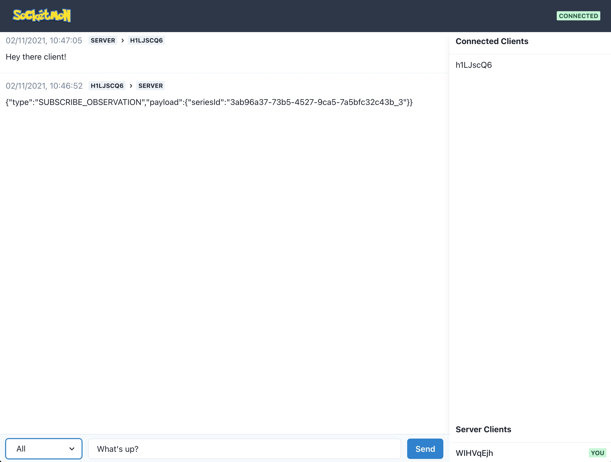

# Socketmon
### Gotta Watch 'em All!

A WebSocket monitoring tool for inspecting and sending WebSocket messages to connected clients.

<p align="center">
    
</p>

## Installation and usage

First, install the package globally.

```
npm i -g socketmon
```

Then run it by executing:

```
socketmon
```

The WebSocket server will be available on `ws://localhost:6868`

The client for monitoring and sending messages is located at `http://localhost:6767`

## Socketmon in action



## What does it do?

Socketmon creates a debug / temporary server that listens to and sends WebSocket messages to connected clients.

When a WebSocket connection is established from any application, the server will act as a sort of man in the middle which you can inspect from the build-in client.

It makes inspecting and sending WebSocket messages easy without having to build an actual WebSocket server.

## Future plans

One of the features that I really want to add is the ability to proxy an existing WebSocket server.

Feel free to add your thoughts in the issue tracker.

## Credits

Socketmon is a project by [Gaya Kessler](https://theclevernode.com)
